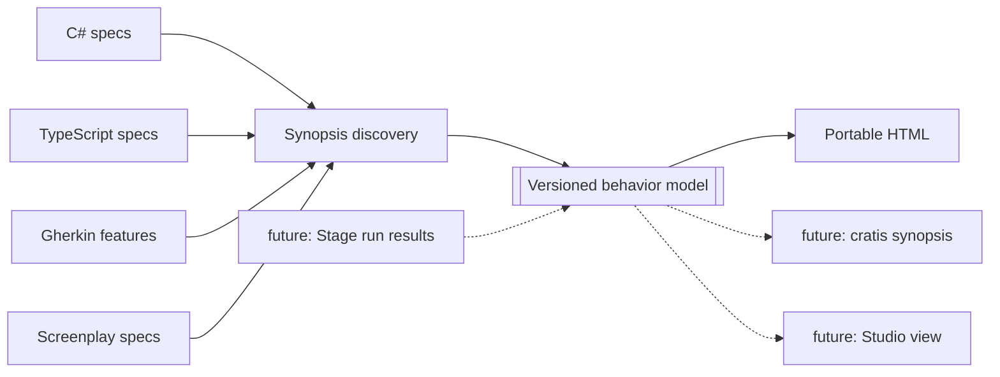

<div align="center">


**Turns the executable examples scattered through a repository into the clearest account of what the system actually promises.**

[](https://github.com/Cratis/Synopsis/actions/workflows/dotnet-build.yml)
[](https://www.nuget.org/packages/Cratis.Synopsis.Tool)
[](https://discord.gg/kt4AMpV8WV)
[](LICENSE)

</div>

---

BDD specifications contain something unusually valuable: examples precise enough for a machine to execute,
yet named so a person can understand the behavior. Then we hide them in test runners, flatten them into green
dots, and make every new contributor rediscover the product by reading implementation code.

**Synopsis puts the story back together.** Point it at a repository and it reads C# backend specs,
JavaScript/TypeScript frontend specs, Gherkin features, and Screenplay specifications already there. It
understands the different conventions runners use to express context, action, examples, and outcomes. The
result is one polished, searchable HTML file organized by module and feature—not a test report, but living
behavior documentation with every statement linked back to its evidence.

## Why “Synopsis”? 

- **It tells the whole plot without replaying every line.** A synopsis preserves the important context,
  action, and consequence while making a large body of work navigable.
- **It describes the show that was actually performed.** Screenplay expresses the desired system and Stage
  performs it; Synopsis reads the executable examples the implementation uses to prove its behavior.
- **It belongs in the Cratis storytelling family.** Chronicle records what happened, Arc shapes the plot,
  Screenplay holds the script, Stage performs it, Studio visualizes it, Prompter helps with the lines—and
  Synopsis tells readers what the production does.

## From specification to story

This backend behavior:

```csharp
class when_borrowing_an_available_book : given.a_registered_member
{
    void Because() => _receipt = _checkout.Borrow(_book, _member);

    [Fact] void should_confirm_the_loan() => _receipt.Confirmed.ShouldBeTrue();
    [Fact] void should_set_the_due_date_three_weeks_ahead() =>
        _receipt.DueDate.ShouldEqual(_today.AddDays(21));
}
```

and this frontend behavior:

```typescript
describe('when searching by part of an author name', () => {
    beforeEach(() => catalog.withBooksBy('Ursula K. Le Guin', 'Octavia E. Butler'));

    it('shows every matching title', () => results.should.contain('The Dispossessed'));
    it('does not show books by another author', () => results.should.not.contain('Kindred'));
});
```

become readable cards with a shared visual grammar:

```text
FOR  Checkout                           Backend · C#
     Borrowing an available book

GIVEN  A registered member
       The scenario context
WHEN   Borrowing an available book
THEN   Confirm the loan
       Set the due date three weeks ahead

↗ Source/Lending/Checkout/for_Checkout/when_borrowing_an_available_book.cs:6
```

The generated page adds full-text search, Backend / Frontend / Model filters, module navigation, expandable
source evidence, source links, responsive layout, and print styling. It has no server and no external assets;
send it as a file, publish it as a CI artifact, or host it anywhere.

## Quick start

Install the .NET tool and run it at a repository root:

```bash
dotnet tool install --global Cratis.Synopsis.Tool
synopsis . --open
```

That writes `synopsis.html`. No configuration, project restore, or test execution is required. Synopsis uses
static syntax analysis and never loads or runs code from the repository it reads.

Every release also carries the complete .NET tool package as a directly downloadable asset. This is useful
for an air-gapped install or while a newly published version is still reaching NuGet.org:

```bash
VERSION=$(curl -fsSL https://api.github.com/repos/Cratis/Synopsis/releases/latest | grep -m1 '"tag_name"' | cut -d'"' -f4)
mkdir -p .synopsis-packages
curl -fsSL -o ".synopsis-packages/Cratis.Synopsis.Tool.${VERSION#v}.nupkg" \
  "https://github.com/Cratis/Synopsis/releases/download/$VERSION/Cratis.Synopsis.Tool.${VERSION#v}.nupkg"
dotnet tool install --global --add-source "$PWD/.synopsis-packages" \
  --version "${VERSION#v}" Cratis.Synopsis.Tool
```

Generate the portable site and the integration model together:

```bash
synopsis . --format both --output Artifacts/synopsis.html
```

```text
Synopsis found 286 scenarios with 913 outcomes across 14 modules.
  HTML  /work/Ada/Artifacts/synopsis.html
  JSON  /work/Ada/Artifacts/synopsis.json
```

## It speaks the ways Cratis specifies behavior

| Input | Recognized shape | What becomes Given / When / Then |
| --- | --- | --- |
| **C#** | Cratis.Specifications, xUnit, NUnit/TUnit, MSTest, MSpec, LightBDD | inherited contexts; setup/act methods or attributes; test methods and `It` delegate fields |
| **JavaScript / TypeScript** | Vitest, Jest, Mocha, Jasmine, Playwright, Cypress | nested `describe` / `context` / `suite`; hooks; `it` / `test` / `specify`; focused, skipped, todo, and data-driven variants |
| **Gherkin** | Cucumber, SpecFlow, Reqnroll `.feature` files | `Background`, `Rule`, `Scenario`, scenario outlines and example rows, plus Given / When / Then chains |
| **Screenplay** | `.play` specification blocks | `given` / `when` / `then`, including expected errors |

For C#, Synopsis uses Roslyn syntax trees but deliberately performs no semantic compilation. JavaScript and
TypeScript use a balanced scanner that understands nested suites, qualified Playwright calls, function and
arrow callbacks, regular expressions, strings, braces, and comments. Gherkin scenario outlines become one
readable scenario per example row. Malformed input does not hide useful behavior elsewhere in the repository.

## A product map, not a folder dump

Cratis repositories put meaning in their shape. Synopsis knows the conventions:

```text
Source/Core/
  Requests/                         → module
    EmailParsing/                   → feature
      Listing/
        for_AiFeatureTuning/        → subject
          when_a_feature_is_loaded/ → behavior
            and_it_is_tuned.ts      → scenario refinement
```

Explicit BDD prose has priority. Synopsis then combines `for_`, `given`, `when_`, `and_`, and `should_` names
with enclosing suites, type names, namespaces, and folders. Generic segments such as `Source`, `Core`,
`DotNET`, and spec-project names disappear; suffixes such as `Tests` and `Specifications` do not leak into the
story. Root folders become modules when there is no common feature root, matching Ada and Cratis applications.
`--skip-segments` and [`synopsis.json`](Documentation/configuration.md) cover repository-specific layouts.

## Where it belongs

Synopsis is intentionally a **standalone tool and library first**:



- It should run **after specs in CI**, where the HTML becomes a useful artifact or Pages site. It does not
  belong in every normal compile; that would slow the inner loop and write surprising files.
- The **Cratis CLI** can later host the library as `cratis synopsis` for discoverability without coupling the
  capability to Chronicle operations.
- **Screenplay** is an input and will eventually provide its compiler syntax tree directly.
- **Stage** can overlay pass/fail and timing evidence from executed Screenplay specifications.
- **Studio** can consume the versioned JSON and provide module/slice visualization and source navigation.

The rationale and seams are recorded in [product decisions](Documentation/decisions.md) and the
[integration guide](Documentation/integrations.md).

## Command line

```text
synopsis [path] [options]

-o, --output <path>       Output file or folder (default: synopsis.html)
-f, --format <format>     html, json, or both (default: html)
    --title <text>        Document title
    --description <text>  Short introduction shown on the cover
    --source-url <url>    Repository URL used for source links
    --skip-segments <csv> Ignore path segments when inferring modules
    --exclude <csv>       Additional directory names to ignore
    --config <path>       Configuration file
    --fail-on-empty       Exit 2 when no specifications are found
    --open                Open the generated HTML
    --quiet               Only print errors
```

Synopsis infers GitHub source links from the `origin` remote when possible. See
[`Documentation/configuration.md`](Documentation/configuration.md) for the small optional config file.

## CI: make behavior a first-class artifact

Pin Synopsis in a local tool manifest, run it after the test gate, and upload the result:

```yaml
- name: Test
  run: dotnet test --configuration Release
- name: Tell the system's story
  run: dotnet tool run synopsis . --format both --output Artifacts/synopsis.html --fail-on-empty
- uses: actions/upload-artifact@v7
  with:
    name: system-synopsis
    path: Artifacts/synopsis.*
```

The same HTML can be deployed directly to GitHub Pages. The full recipe and an opt-in MSBuild target are in
the [integration guide](Documentation/integrations.md).

## Use as a library

The renderer is separated from discovery by a versioned model:

```csharp
var document = new SpecificationDiscoverer().Discover(new DiscoveryOptions
{
    Input = repository,
    Title = "Bookshop — how it behaves"
});

var html = new HtmlRenderer().Render(document);
var json = new JsonRenderer().Render(document);
```

The [behavior model](Documentation/behavior-model.md) is deliberately free of Roslyn, test-runner, and HTML
types so new parsers and new hosts can meet at a durable boundary.

## Build and contribute

```bash
dotnet test
dotnet build --configuration Release

# Dogfood the sample and open Samples/Bookshop/synopsis.html
dotnet run --project Source/Tool -- Samples/Bookshop --output Samples/Bookshop/synopsis.html
```

The repository follows the same Cratis metadata conventions as Screenplay and Stage: shared package versions,
strict Release builds, Source Link, MIT license, PR/issue templates, build and publish workflows, EditorConfig,
and a canonical `.ai/` assistant corpus with adapters for Codex, Claude, and Copilot.

---

<div align="center">

*The source proves it. Synopsis makes it readable.*

*Part of the [Cratis](https://cratis.io) platform · Licensed under the [MIT license](LICENSE)*

</div>
